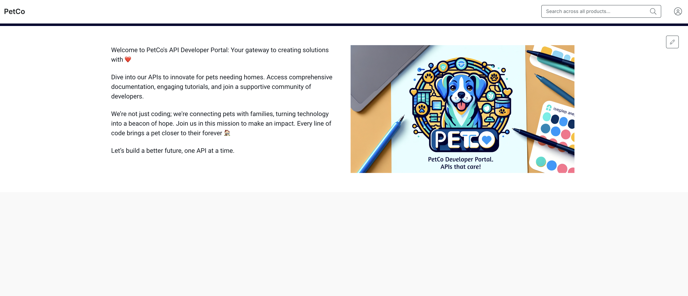
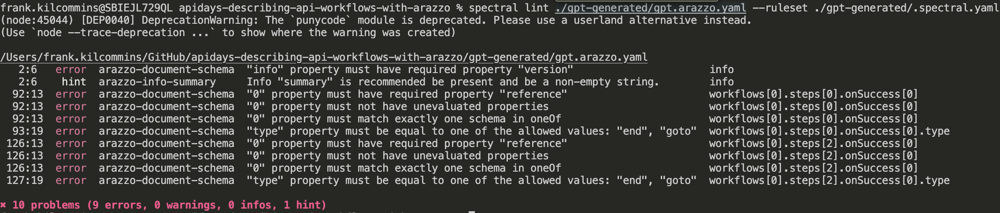
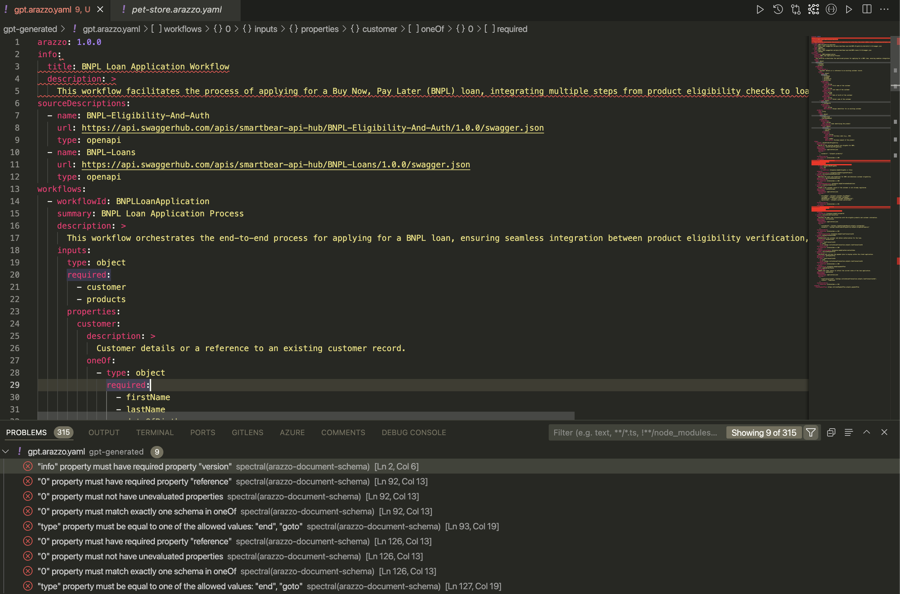
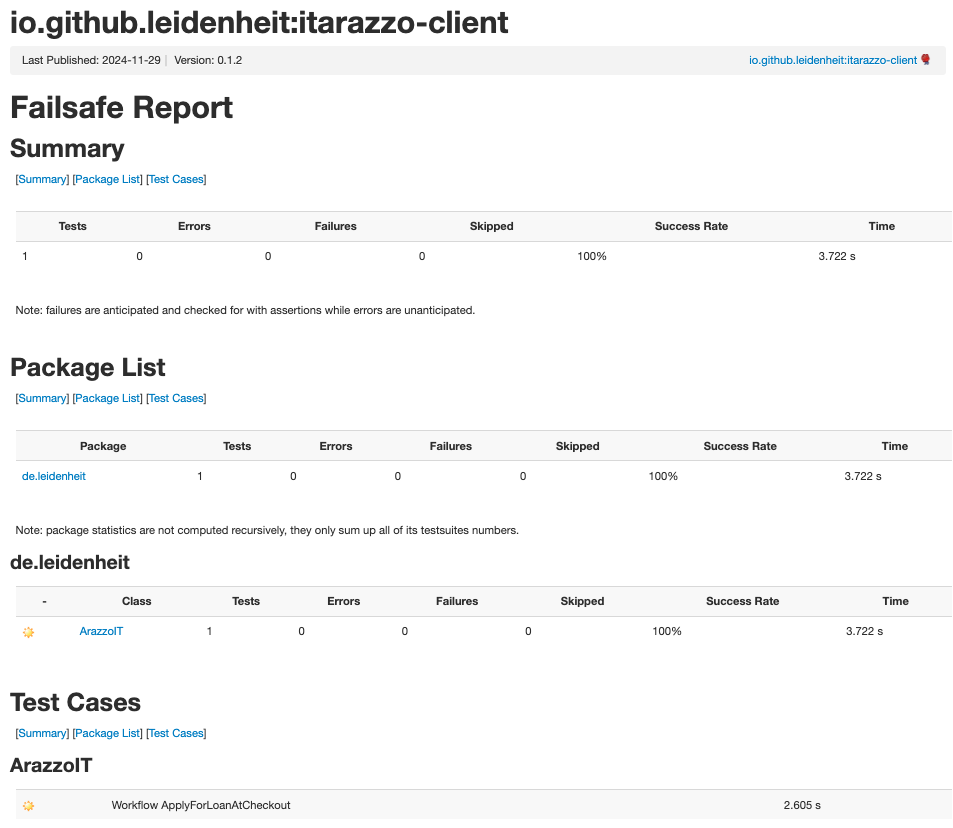
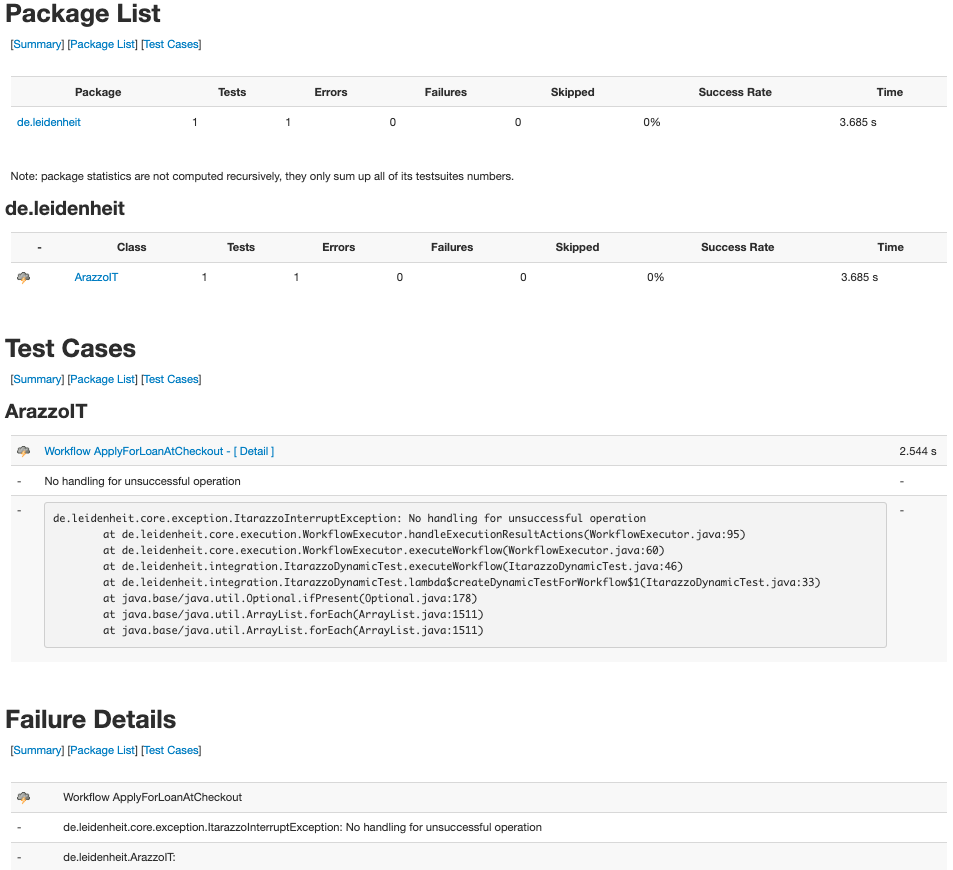
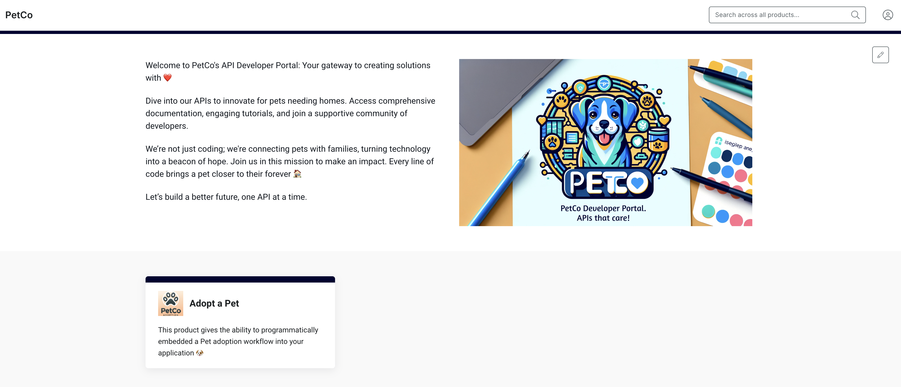

# Describing API Workflows with Arazzo (APIDays Paris 2024)

This repo contains examples of using Arazzo in the wild. It focuses on working in a scenario where from existing APIs we want to craft and publish use case orientated workflows to a developer portal. These workflows clearly explain the capabilities and steps to integrate such capabilities (spanning multiple APIs) into a client application.

This sample repo showcases how to use the Arazzo Specification GPT, Spectral, VSCode, and Itarazzo to generate stellar API guides published to a SwaggerHub Portal instance. This is focused on showcasing emerging tooling to get started with the new [Arazzo Specification](https://spec.openapis.org/arazzo/latest.html) from the [OpenAPI Initiative](https://www.openapis.org/).

**You can choose your own adventure:**

- 🐶 `Adopt a Pet` workflow - **this branch**
- 💵 `Buy Now Pay Later` workflow - go to the [main](https://github.com/frankkilcommins/apidays-describing-api-workflows-with-arazzo) branch


## Tools

- [Visual Studio Code](https://code.visualstudio.com/)
- [Arazzo Specification Custom GPT](https://chatgpt.com/g/g-673339c216648190a97a5fa3d8258769-arazzo-specification)
- [Spectral](https://github.com/stoplightio/spectral) -  flexible JSON/YAML linter for creating automated style guides, with baked in support for OpenAPI (v3.1, v3.0, and v2.0), Arazzo v1.0, as well as AsyncAPI v2.x.
- [Spectral VSCode Extension](https://marketplace.visualstudio.com/items?itemName=stoplight.spectral) - The Spectral VS Code Extension brings the power of Spectral to your VSCode IDE.
- [Prism](https://github.com/stoplightio/prism/) - an open-source HTTP mock and proxy server.
- [Itarazzo](https://github.com/leidenheit/itarazzo-client/tree/develop) - a testing tool for Arazzo Specification documents.
- [SwaggerHub Portal](https://swagger.io/tools/swaggerhub/features/swaggerhub-portal/) - an enterprise grade Developer Portal.

## Prerequisites

Set up the tools above and/or accounts where required.

## Demonstration Steps

1. Leverage **Arazzo Specification** Custom GPT to kick start Arazzo creation from existing APIs
2. Validate the produced Arazzo document using Spectral CLI
3. Fix feedback using VSCode Editor (with Arazzo enriched editing via the **Spectral extension**)
4. Test and validate the Workflow
   - Mock the APIs with **Prism**
   - Run/test the workflow with **Itarazzo**
   - View the generated reports
5. Pass the tuned Arazzo document back into Arazzo Specification GPT to generate on-boarding guides
6. Update the markdown files in the code repository
7. Publish API and guides to a Developer portal (using GitHub action)

## Our Workflow spans multiple APIs

The Pet Adoptions workflow we'll create leverages operations exposed by the following APIs:

- **Pets API:** [view JSON](https://api.swaggerhub.com/apis/frank-kilcommins/Pets-API/1.0.0/swagger.json) or [view in SwaggerHub](https://app.swaggerhub.com/apis/frank-kilcommins/Pets-API/1.0.0)
- **Adoptions API:** [view JSON](https://api.swaggerhub.com/apis/frank-kilcommins/Adoptions-API/1.0.0/swagger.json) or [view in SwaggerHub](https://app.swaggerhub.com/apis/frank-kilcommins/Adoptions-API/1.0.0)

## What's currently in our Developer Portal

Let's take a quick look at the [PetCo](https://frankkilcommins.portal.swaggerhub.com/) developer portal to see existing products. This is where we want to end up publishing our new **Adopt a Pet** product.

It should look like:


## Step 1. Generate an Adopt a Pet Workflow leveraging existing APIs

Rather than starting hand-crafting an Arazzo Document by hand, let's take advantage of the Arazzo Specification custom GPT that's available within OpenAI's ChatGPT store.

- Within ChatGPT add the `Arazzo Specification` custom GPT from the GPT store or access directly [here](https://chatgpt.com/g/g-673339c216648190a97a5fa3d8258769-arazzo-specification).
- Send a prompt similar to below containing instructions to create the _Adopt a Pet_ Workflow in an Arazzo Document:

```text
There's are two OpenAPI located at 
- https://api.swaggerhub.com/apis/frank-kilcommins/Pets-API/1.0.0/swagger.json
- https://api.swaggerhub.com/apis/frank-kilcommins/Adoptions-API/1.0.0/swagger.json

I'd like you to process those documents and generate a detailed Arazzo Document for "Adopting a pet matching specific criteria" based on the appropriate endpoints within the APIs above. 

The workflow should  carry out the following steps: 
- Search for a pet 
- Initiate adoption request 
- Confirm adoption by updating status 
- Verify pet has been updated to adopted

Notes: 
- Use as much detail as possible. 
- Ensure the Arazzo Document is valid according to the Arazzo Specification. 
- Ensure step outputs are properly specified.
- Include one syntactical error that I can fix afterwards (e.g. omit the info.version).
```

> ℹ️ Note - I ask for at least one syntax issue which we can highlight with linting

## Step 2. Save the generated Arazzo and lint with Spectral

We can leverage Spectral to help validate the output from the Arazzo Specification GPT and weed out any syntax issues that may exist.

> Note: You should always validate from a human perspective that the generated Arazzo is also as expected and steps do what's intended.

1. Create a new file (e.g. `gpt.arazzo.yaml`) within `/gpt-generated`, and paste in the generated Arazzo document.
2. Create a `.spectral.yaml` file and extend the `Arazzo` core ruleset by adding the following

    ```yaml
    extends: ["spectral:arazzo"]
    ```

3. Lint the gpt generated file using Spectral CLI. Within your terminal run the following command:

    ```shell
    spectral lint ./gpt-generated/gpt.arazzo.yaml --ruleset ./gpt-generated/.spectral.yaml
    ```

Depending on the generated GPT you may see varying feedback from Spectral



## Step 3. Adjust and fix the Arazzo document in VSCode leveraging the **Spectral Extension**

We can use VSCode or any editor to adjust the Arazzo document and leverage the Spectral CLI commands again to verify our resolutions. Alternatively, to have a more enriched editing experience, we can enable the Spectral VSCode extension which also has built-in support for Arazzo. This allows us to get immediate feedback directly within the IDE.

Assuming the Spectral Extension is installed, create a `.spectral.yaml` file at the root of your project which extends the Arazzo core ruleset (this is the same content in the ruleset for the CLI and/or the VS Code extension).

```yaml
extends: ["spectral:arazzo"]
```

You now will get rich intellisense, documentation, syntax highlighting and more directly within files identified as Arazzo documents.



## Step 4. Test and validate the Workflow

To test and validate the workflow we'll first mock the underlying APIs using **Prism** which can generate an API mock directly from an OpenAPI description, and then take advantage of a new open source tool called **Itarazzo** to run the workflow and get a generated report with feedback on the execution.

> ⚠️ Warning: Itarazzo will execute the workflow, so ensure you're using appropriate Servers and Security mechanisms

> note: you'll need to add the appropriate docker internal host server URLs to the OpenAPI descriptions, so that Itarazzo can make the appropriate requests (e.g. `http://host.docker.internal:8086`)

### Mock our Pets and Adoptions APIs using Prism and Docker

#### Mock Pets API

If you use `make` then run the pre-configured command:

```shell
make provider_mock_pets_prism
```

Alternatively, run the explicit docker / prism command:

```shell
docker run --add-host=host.docker.internal:host-gateway -d --init --rm --name prismPets -v ${PWD}/specs:/specs -p 8086:4010 stoplight/prism:latest mock -h 0.0.0.0 "specs/pets.openapi.yaml"
```

#### Verify the mock is available

Run the following curl command or pre-configured `make request-pets` command:

```shell
curl "localhost:8086/pets?status=available&location=galway" --header "Accept: application/json"
```

#### Mock Adoptions API

If you use `make` then run the pre-configured command:

```shell
make provider_mock_adoptions_prism
```

Alternatively, run the explicit docker / prism command:

```shell
docker run --add-host=host.docker.internal:host-gateway -d --init --rm --name prismAdoptions -v ${PWD}/specs:/specs -p 8087:4010 stoplight/prism:latest mock -h 0.0.0.0 "specs/adoptions.openapi.yaml"
```

#### Verify the Eligibility API mock is available

Run the following curl command or pre-configured `make request-adoptions` command:

```shell
curl "localhost:8087/adoptions?status=requested&location=galway" --header "Accept: application/json"
```

### Execute the workflow using Itarazzo

For Itarazzo to run, it needs the Arazzo Document and a JSON file containing the necessary inputs (which naturally MUST be according to the schema defined in the Arazzo document for the workflow inputs).

Here's an example of the `/specs/pet-adoptions-arazzo-inputs.json` that we'll use for our workflow run.

```json
{
  "searchCriteria": {
    "type": "dog",
    "breed": "Golden Retriever",
    "age": "young",
    "location": "Galway"
  },
  "adopterDetails": {
    "name": "Jane Doe",
    "contactInformation": {
      "email": "jane.doe@example.com",
      "phone": "123-456-7890"
    }
  }
} 
```

> ⚠️ Warning: Itarazzo will execute the workflow, so ensure you're using appropriate Servers and Security mechanisms
You can run the pre-configured `make` command to run Itarazzo:

```shell
make itarazzo_client
```

Alternatively, construct the appropriate docker run command like (note we also create a `reports` directory to store the generated report files):

```shell
mkdir -p reports
docker run -t --rm \
  --add-host=host.docker.internal:host-gateway \
  -e ARAZZO_FILE=/itarazzo/specs/pet-adoptions.arazzo.yaml \
  -e ARAZZO_INPUTS_FILE=/itarazzo/specs/pet-adoptions-arazzo-inputs.json \
  -v $$PWD/specs:/itarazzo/specs \
  -v $$PWD/reports:/itarazzo/target/reports \
  leidenheit/itarazzo-client
```

Head over the [Itarazzo GitHub](https://github.com/leidenheit/itarazzo-client/tree/develop) for more options.

🚀🚀 **We have a successfully executed workflow!!**

### View the generated report

Check out the `/reports/failsafe.html` for details on the workflow execution.



### 🚨 What does failure look like?

To showcase what happens if the workflow fails, I've created a failing workflow. To execute the failing workflow run:

```shell
make itarazzo_client_error
```

Alternatively, run the docker run command:

```shell
mkdir -p reports
docker run -t --rm \
    --add-host=host.docker.internal:host-gateway \
    -e ARAZZO_FILE=/itarazzo/specs/error-bnpl.arazzo.yaml \
    -e ARAZZO_INPUTS_FILE=/itarazzo/specs/formal-bnpl-arazzo-inputs.json \
    -v $$PWD/specs:/itarazzo/specs \
    -v $$PWD/reports:/itarazzo/target/reports \
    leidenheit/itarazzo-client
```

### View the failure on generated report

Check out the `/reports/failsafe.html` for details on the workflow execution.




### What caused the error

We can drill into the Prism logs to get more info. Run:

```shell
make prism-pets-logs
```

Alternatively, run the docker command to get the last few logs:

```shell
docker logs --tail 10 -f prismPets
```

```text
[9:11:34 AM] › [HTTP SERVER] patch /pets/c76b67cb-7976-4b94-af8e-381688c915ae ℹ  info      Request received
[9:11:34 AM] ›     [NEGOTIATOR] ℹ  info      Request contains an accept header: */*
[9:11:34 AM] ›     [VALIDATOR] ⚠  warning   Request did not pass the validation rules
[9:11:34 AM] ›     [VALIDATOR] ✖  error     Request body property status must be equal to one of the allowed values: available, pending, onhold, adopted
[9:11:34 AM] ›     [NEGOTIATOR] ✔  success   Found response 422. I'll try with it.
[9:11:34 AM] ›     [NEGOTIATOR] ✔  success   The response 422 has an example. I'll keep going with this one
[9:11:34 AM] ›     [NEGOTIATOR] ✔  success   Responding with the requested status code 422
[9:11:34 AM] ›     [NEGOTIATOR] ℹ  info      > Responding with "422"
[9:11:34 AM] ›     [VALIDATOR] ✖  error     Violation: request.body.status Request body property status must be equal to one of the allowed values: available, pending, onhold, adopted
```

We can see that the request made to the `PATCH /pets/{id}` was missing a required body property.

## Step 5. Generate Developer Docs from Arazzo

To improve the consuming developer experience and reduce the time and effort they need to expend integrating the _Adopt a Pet_ into their client applications, let's take advantage of Arazzo's determinism and use it to craft a stellar _Getting Started_ guide.

Rather than write this by hand, let's pass our refined Arazzo Document back into the **Arazzo Specification Custom GPT** and have it craft the docs for us.

### Sending the prompt to the GPT

The Arazzo Specification GPT has been trained on crafting Getting Started guides. Craft a prompt as follows for it to leverage training templates to produce the desired markdown output.

Here's a sample prompt to give you an idea:

```text
Use your instruction template to generate a documentation for our developer portal based on the 'Adopt a Pet' workflow. 

Use the following additions for clarity:
The full content MUST be one piece of markdown that can be copied.
Include developer tips within each markdown section.

Here's the fixed up Arazzo document to process:

<<PUT YOUR ARAZZO DOCUMENT HERE>>

```

> Have a little back an forth with the GPT if needed to get the output you're happy with

## Step 6. Update the markdown files in the code repository

Take the GPT markdown output and save it within `./products/Adopt a Pet/Getting-Started-with-Pet-Adoptions.md`

> Tip: Manually adjust as required, spell check etc.

> NOTE: Ensure the `mermaid` block is closed (e.g. all the syntax should be within ```mermaid .....```)

## Step 7. Publish API and guides to a Developer portal (using GitHub action)

SwaggerHub Portal cannot yet (although coming soon!) render raw `mermaid` syntax, so let's convert the gpt generated `mermaid` syntax into a _PNG_. To do so run either of the following commands:

```shell
make mermaid-to-png
```

```shell
sh scripts/generate-images.sh
```

Now we're ready to commit and publish our new **Adopt a Pet** product to our portal. All the data and configurations are contained within `./products/Adopt a Pet/` and we've a GitHub action that takes advantage of the [SwaggerHub Portal APIs](https://www.youtube.com/watch?v=K4mGTkd8qcw) using a [Docs-As-Code](https://www.youtube.com/watch?v=7D5bbaj60Cc) convention-based process to structure the setup of the Portal products.

1. Commit the changes
2. Manually run the `Portal-Docs-Publish` Action on this repo using the `frankkilcommins` environment option

Now we've deployed our product to the portal:

