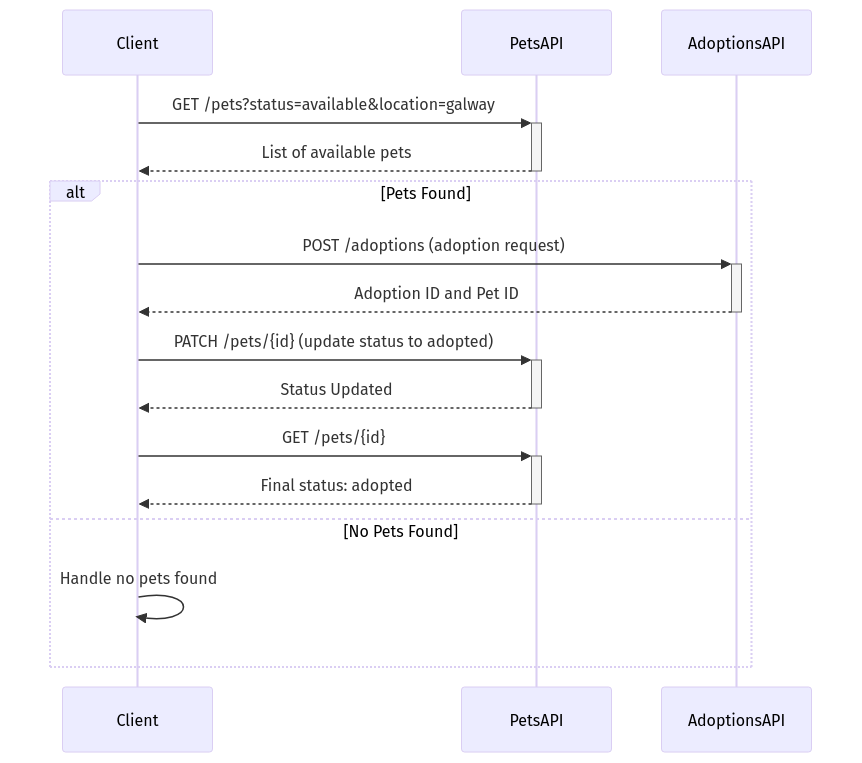

# Adopt a Pet Workflow Documentation

## Overview

This workflow provides developers with a structured way to adopt a pet using the Pets and Adoptions APIs. The process includes searching for available pets, initiating an adoption request, confirming the adoption by updating the pet's status, and verifying the adoption's success.

---

## Metadata Summary

| Attribute                  | Value                                     |
|----------------------------|-------------------------------------------|
| Specification Version      | 1.0.0                                    |
| Number of APIs             | 2 (Pets API, Adoptions API)              |
| Number of Workflows        | 1                                        |
| Workflow Validity          | Yes                                      |
| OpenAPI Files Validity     | Yes                                      |
| API Surface Area Coverage  | 75%                                      |

**Developer Tip**: Ensure both API endpoints are accessible from your environment before implementation.

---

## Workflow Summary Table: AdoptPetMatchingCriteria

| Step                | Operation ID                      | Parameters              | Outputs            | Description                                         |
|---------------------|------------------------------------|-------------------------|--------------------|-----------------------------------------------------|
| `searchForPet`      | `getPets`                         | `status`, `location`    | `availablePets`   | Searches for pets based on the criteria provided.  |
| `initiateAdoptionRequest` | `postAdoption`                | `Authorization` header  | `adoptionId`, `adoptedPetId` | Initiates the adoption process for a selected pet. |
| `confirmAdoption`   | `patchPetStatus`                 | `id`                    | `petStatus`       | Updates the pet's status to 'adopted'.            |
| `verifyAdoption`    | `getPetById`                     | `id`                    | `finalPetStatus`  | Confirms the pet's status is set to 'adopted'.     |

**Developer Tip**: Always validate API responses to handle scenarios where the pet might not be available for adoption.

---

## Developer Insights

- **Inputs Overview**:
  - `searchCriteria`: Defines the type, breed, age range, and location of the desired pet.
  - `adopterDetails`: Includes the adopter's name and contact information.

### Input Example

```json
{
  "searchCriteria": {
    "type": "dog",
    "breed": "labrador",
    "age": "puppy",
    "location": "galway"
  },
  "adopterDetails": {
    "name": "John Doe",
    "contactInformation": {
      "email": "john.doe@example.com",
      "phone": "123456789"
    }
  }
}
```

## Graphical Representation of the Workflow



